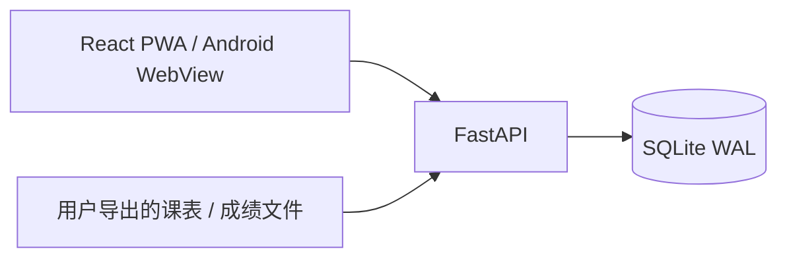

# 架构

```mermaid
flowchart LR
  PWA[React PWA / Android WebView] --> API[FastAPI]
  File[用户导出的课表 / 成绩文件] --> API
  API --> DB[(SQLite WAL)]
```

前端优先读取后端缓存。课程表仅接受用户主动上传的教务系统打印 `.xls`；成绩分析仅接受用户主动上传的 `.xls` 或 HTML 成绩表。上传原文件只在请求内存中解析，不保存到数据库或文件系统。

默认校历：`2026-2027-1` 第一周周一为 `2026-09-07`，`2026-2027-2` 为 `2027-03-01`。其他学期必须由用户显式配置。
